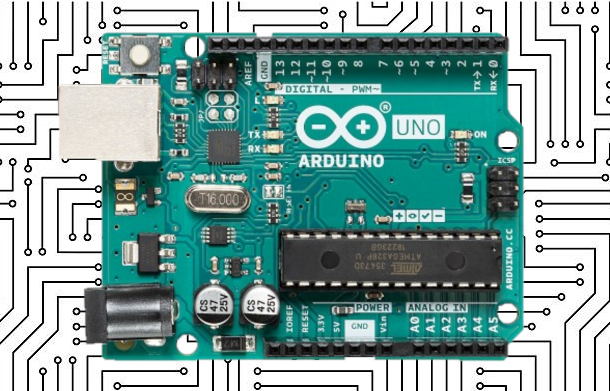

# Learning to Program Electronics

__A guide on starting off with Arduino programming__ *by Z0161166*

## Introduction
Arduino is an open-source electronics programming platform for creating custom circuits.
Simply put, the platform is made up of two parts:
1) Hardware
2) Software

These two parts come together to form an open __ in conjunction to create an environment where circuits can be desingned and contolled by a program running on a single circuitboard. Enabling the versatility that makes it such a powerful tool.

Whow are arduino's suitable for? Low barrier of entry. This guide is for anyone who fits this criteria, finds the topic interesting and would like advice on how to begin their arduino journey.

## What prior knowledge do you need?
As stated earlier, learning to program for an arduino is very approachable. Programs for an Arduino are known as sketches and are written in C++. Some knowledge on the basic principles of programming are needed to begin learning to program an arduino like variables, conditionals and loops. While it is not required to start, being familiar with the basic syntax used in C languages will be very useful when it comes to writing sketches. The followning [codeacademy tutorial](https://www.codecademy.com/learn/learn-c-plus-plus) is a great way to become more acquainted with C++.

If you haven't had any experience with building circuits don't worry! Almost all online project tutorials come with circuit diagrams that are straight forward to follow regardless of your skill set. For an initial guide on how to create circuits using a breadboard, I recommend reading through  [this article](https://learn.sparkfun.com/tutorials/how-to-use-a-breadboard/all).

## Why learn Arduino Programming?
If you've ever been curious about how every day electronics work then there's no more approachable way of getting hands on experience with the inner workings of electronics. Have you ever wondered how your phone communicates with a card reader when you use contactless payments? What about how sound is recorded and stored digitally. While you could always find out find out from an online article or by scrawling through forums, experimenting with the technology can be a much more engaging and enriching experience.   
If you've ever looked at a device and wished it had some extra funuctionality then why not just make your own version? Programming and circuit building is such a creative and versatile skill the limit to the circuits you can make is laregly bound by your imagination and motivation to learn (Cheesy but true).

Why not just use a PC? Devices that need to be portable. Easier way of directly interfacing with hardware. If you've ever been curious about how the electronics you use every day work.

If this aspect of programming arduinos is of particular interest to you then you're in luck! A huge subset of engineering is comprised of electronics engineers who are responsible for designing and developing electrical systems for industry. As the world turns to automate jobs more and more, this sector is only expected to become more and more important.

Even if you don't find this prospect particularly appealing, learning C++ can still be beneficial to a potential career in programming. Despite it's age, C++ is still widley used in modern life. Most languages share common features or are based on C++ in some form, learning to program an arduino will improve your general programming ability.

## So, how do you start?
The first step is to purchase an Arduino microcontroller. There are many different types of circuit boards that Arduino offer. The most readily available, popular and cheap is the Arduino Uno. As a result, it also has the most documentation making it perfectly suited for beginners. While Arduino do produce and sell their own circuit boarads, there are many third party variations made by other manufacturers that are functionally identical to their first party counterparts but can be found online for much cheaper.

Many online electronics retailers offer kits that bundle together the circuit board itself with everything a beginner may need to get started such as a breadboard, wires and a variety of components to build almost any type of circuit. While this can seem a bit overwhelming at first, having all of the components you need from the start gives you the freedom of being able to create and experiment with circuits to your hearts content. [Here](https://www.ebay.co.uk/itm/RFID-Learning-Starter-Kit-Set-Arduino-UNO-R3-Upgraded-Version-Learning-Suite-Ace-/163826363177) is the kit I used when learning. Remember in the future you can always buy more components for projects as you need them.

So that's the hardware covered, now for the software. Arduino boasts their own integrated development environment (IDE) that contains all the basic features that you might need to write your first program. As you begin to write larger programs however, you may want to consider using a more feature rich IDE. Thanks to the arduino being open source, there are plenty third party options to choose from. I can recommend the [arduino extension for VS code](https://marketplace.visualstudio.com/items?itemName=vsciot-vscode.vscode-arduino) which integrates with git seamlessly and provides additional debugging tools to help you figure out why a program isn't working as expected.

## Software of an Arduino
So what does the program that runs on an arduino look like? To answer that here is an annotated program taken from Arduino's official set of examples:  
```
void setup() {  
   pinMode(LED_BUILTIN, OUTPUT);
}
```
>The setup function is executed once when the arduino is first powered up. This function sets the onboard LED as an output.
```
void loop() {
  digitalWrite(LED_BUILTIN, HIGH);
  delay(1000);
  digitalWrite(LED_BUILTIN, LOW);
  delay(1000);
}     
```
>As soon as the setup function is executes, the loop function is ran repeatedly until the arduino loses power or is turned off. This section of the code indefinitely turns the light on, waits a second then turns the light off.

## Hardware of an Arduino
The UNO is based on a 8-bit atmega processor.
Runs at 16MHz with 32KB of storage and 2KB of RAM. Miniscule even compared to the specs of modern phones making the Processing power the largest limitation of the UNO. However, this is all that's required for most of the circuits you may want to create. The board contains more than just a processor however:  
*Image of arduino pinout*

## Helpful Resources
There are so many helpful resources readily available online for learning how to program an arduino. Here are a handful that I found especially helpful:  
| Name | Type of resource | Explanation |
|---|---|---|
| [arduino.cc](arduino.cc) | Tutorials and Module documentation | Every inbuilt function and code library compatible with an arduino is intricately documented. In addition to this the website contains plenty of official examples for writing programs for the arduino as well as a community hub where users are free to post tutorials for their own projects |
| [howtomechatronics](https://howtomechatronics.com/arduino-projects/) | Arduino Tutorials | Arduino tutorials with accompanying videos that explain the project in more detail and showcase the end result |
| [lastminuteengineers](https://lastminuteengineers.com/electronics/arduino-projects/) | Arduino Tutorials | Project tutorials with an added emphasis on the electronics, explaining the  how each component works |
| [circuito.io](https://www.circuito.io/) | Project Planner | An all-in-one development environment for planning an arduino circuit and writing the code to run on it. Smart circuit builder calculates how much power the circuit requires and auto-magically adds resistors and voltage regulators where they are needed |
| [w3schools](https://www.w3schools.com/cpp/) | C++ Tutorials | Great resource for checking basic C++ syntax. Has a page on any aspect of C++ you might want to check |

## Gloassary of Terms
One thing that can deter new users away from learning how to program an arduino is all of the new terminology - can seem daunting. Here is are is a gloassary of some of the most frequently used terms:

__Sketch -__ A program written in C++ that is executed on an arduino  
__PWM -__  
__Interrupt -__  
__Stepper -__ Short for stepper motor, a precise motor  
__Compile -__  
__Upload -__  

## Evaluation of My Experience
Round up my experience with programming an Arduino. Was it worth it for me? Will it be worth it for the audience?

If you've made it this far into this guide then I'm willing to bet that you'll benefit from learning to program an arduino in one way or another.
