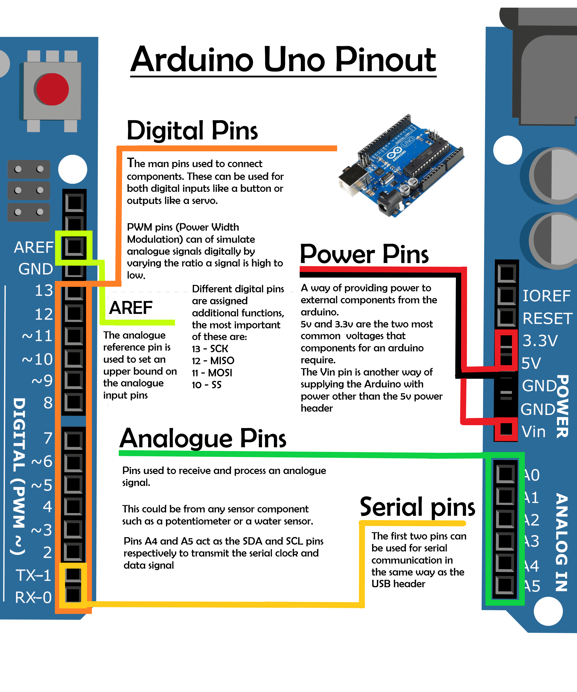

# Learning to Program Electronics
[](https://www.arduino.cc/glossary/en/)  
__Starting off with Arduino programming__ *by Z0161166*

## Introduction
Arduino is an open-source electronics programming platform for creating custom circuits.
Simply put, the platform is made up of two parts:
1) A physical programmable circuit board that directly interfaces directly with the circuit.
2) A piece of code developed on a conventional computer to control the circuit which is compiled and uploaded to the board.

The hardware and the software come together to create a system where circuits can be contolled by a single program running on a single circuit board. No hardware other than a USB cable is needed to reporgam the circuit board. This combined with standard open-source form factor of the circuit boards makes the barrier of entry for learning open to almost anyone. This guide is for anyone who is intrigued by making their own circuits and would like advice on how to begin their journey with Arduino.

## What prior knowledge do you need?
Programs for an Arduino are referred to as sketches and are written in C++. Some knowledge on the basic principles of programming are needed before starting like variables, conditionals and loops. While it is not essential, being familiar with the basic syntax used in C languages will be very useful when it comes to writing sketches. The following [codeacademy tutorial](https://www.codecademy.com/learn/learn-c-plus-plus) is a great way to become more acquainted with C++.

If you haven't had any experience with building circuits don't worry! Almost all online project tutorials come with circuit diagrams that are straight forward to follow regardless of your prior knowledge. For an initial guide on how to create circuits using a breadboard, I recommend reading through [this article](https://learn.sparkfun.com/tutorials/how-to-use-a-breadboard/all).

## Why learn Arduino Programming?
Have you ever wondered how your phone communicates with a card reader when you use contactless payments? What about how the LED display works on a calculator? If you've ever been curious about how every day electronics work then there's no easier way of getting hands on experience. While you could always learn by reading through online articles or forums, physically experimenting with the technology can be both more engaging and enriching.

If you've ever looked at a device and wished it had some extra funuctionality then why not just make your own version? Programming and circuit building is such a creative and versatile skill; the limit to the circuits you can make with Arduino is mostly your imagination and motivation to learn.

If this aspect of programming Arduinos is of particular interest to you then you're in luck! A huge subset of engineering jobs are electronics engineers who are responsible for designing and developing electrical systems on a larger scale.

Even if you're not the type to create your own inventions, learning C++ can still be beneficial to a potential career in programming. Despite it's age, C++ is still widley found in the programming of games, operating systems and browsers.

## So, how do you start?
The first step is to purchase an Arduino microcontroller. There are many different types of circuit boards that Arduino offer. The most readily available, popular and cheap is the Arduino Uno. As a result, it also has the most documentation making it perfectly suited for beginners. While Arduino do produce and sell their own circuit boards, there are many third party variations that are functionally identical to their official counterparts but can be found online for much cheaper.

Many online electronics retailers offer kits that bundle together the circuit board itself with everything a beginner may need to get started such as a breadboard, wires and a variety of components. While this can seem a bit overwhelming at first, having all of the components you need from the start gives you the freedom of being able to create and experiment to your hearts content. [Here](https://www.ebay.co.uk/itm/RFID-Learning-Starter-Kit-Set-Arduino-UNO-R3-Upgraded-Version-Learning-Suite-Ace-/163826363177) is the kit I used when learning. Remember in the future you can always buy more components for projects as you need them.

So that's the hardware covered, now for the software. Arduino provides their own integrated development environment (IDE) that contains all the basic features that you might need to write your first program. As you begin to write larger programs, you may want to consider using a more feature rich IDE. Thanks to the Arduino being open-source, there are plenty third party options to choose from. I can recommend the [Arduino extension for VS code](https://marketplace.visualstudio.com/items?itemName=vsciot-vscode.vscode-arduino) which integrates with git seamlessly and provides additional debugging tools to help you figure out why a program isn't working as expected.

## Software
What does a sketch look like? All Arduino programs can be divided into two parts: a setup and a loop. Here is a simple annotated program taken from Arduino's official set of examples.
```
void setup() {  
   pinMode(LED_BUILTIN, OUTPUT);
}
```
>The setup function is executed once when the board is first powered up. This specific example primes the onboard LED as an output.
```
void loop() {
  digitalWrite(LED_BUILTIN, HIGH);
  delay(1000);
  digitalWrite(LED_BUILTIN, LOW);
  delay(1000);
}     
```
>As soon as the setup function is executed, the loop function is ran repeatedly until the board loses power or is turned off. This section of code indefinitely turns the light on, waits a second then turns the light off.

## Hardware
The Uno is based on an 8-bit atmega processor that runs at 16MHz with access to 32KB of storage and 2KB of RAM. This is miniscule even when compared to the specs of modern phones making processing power a huge limitation of what the Uno can accomplishes. The board contains more than just a processor however:  

  

In addition to these pins, the Uno also has a 5v DC power header, a full sized type A USB and a physical reset button.

## Helpful Resources
There are so many helpful resources readily available online for learning how to program an Arduino. Here are a handful that I found especially helpful:  
| Name | Type of resource | Explanation |
|---|---|---|
| [arduino.cc](arduino.cc) | Tutorials and Module documentation | Every inbuilt function and code library compatible with an arduino is intricately documented. In addition to this, the website contains plenty of official examples for writing programs for the arduino as well as a community hub where users are free to post tutorials for their own custom projects |
| [howtomechatronics](https://howtomechatronics.com/arduino-projects/) | Arduino Tutorials | Arduino tutorials with accompanying videos that explain the project in more detail and showcase the end result |
| [lastminuteengineers](https://lastminuteengineers.com/electronics/arduino-projects/) | Arduino Tutorials | Project tutorials with an added emphasis on the electronics, explaining the  how each component works in enough detail |
| [circuito.io](https://www.circuito.io/) | Project Planner | An all-in-one development environment for planning the layout to a circuit and writing the code for it. Smart circuit builder calculates how much power the circuit requires and auto-magically adds resistors and voltage regulators where they are needed |
| [w3schools](https://www.w3schools.com/cpp/) | C++ Tutorials | Great website for checking the syntax of C++ |  

## Evaluation of My Experience
The most difficult part of my learning experience was debugging. When encountering a problem during the creation process, it is never immediately obvious whether the problem is with the circuit, the code or even the components themselves. However, the quantity of resources available meant I never felt completely alone or lost while learning. One piece of advice I would give to beginners is to be patient - follow tutorials carefully and utilise all of the debugging tools available.

Overall, I think that these difficulties were well worth overcoming for the benefits brought from this assignment. Programming an Arduino encompasses a broad range of skills such as programming in C++ and circuit design that are highly applicable in many different environments. Supporting the platform is a highly active and welcoming community containing hundreds of open-source projects all with the potential of further captivating your interest and curiosity.

If you've managed to make it this into the guide and you're still intersted, I'm willing to bet that you'll benefit from learning to program an Arduino in one way or another.
