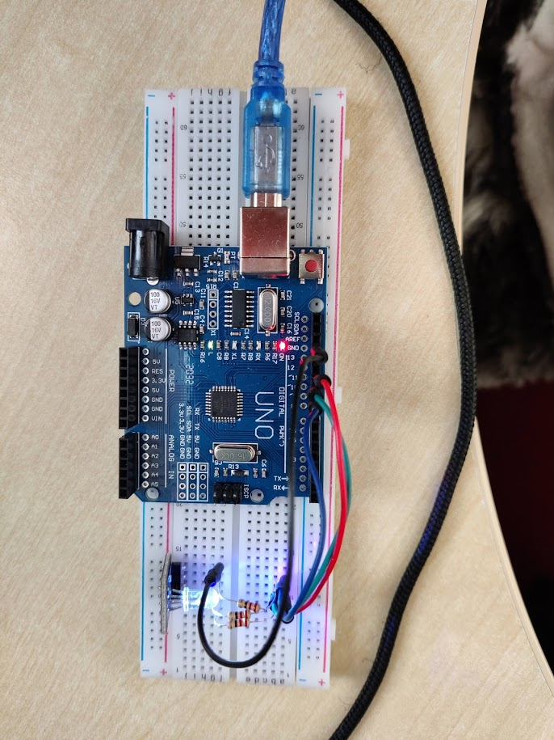

# Learning Log 1
*For the week beginning 01/03/21*

## What skill am I learning?
Over the next few months I am planning to learn how to:
- Write and develop programs in C++ using the Aruino IDE. Learn how an Arduino executes code and how to utulise the built in functions. 
- Deeign and construct circuits comprised of wires, a breadboard and a variety of basic components. Learn the hardware limitations of what circuits an Arduino can control.
- Upload and run these programs on an Arduino. Learn how to test the functionality of the circuits, what it takes to debug them and experiment how changes to the code impact the physical circuit.

## Initial Goals
What I aim to accomplish on a fortnightly basis
1. Learn to use the arduino IDE. Become familiar with the methods/functions used to program an arduino, learn about the hardware on the arduino
2. Create more complex circuits involving motors and other components (variety of input, outputs). Start researching the what skills and components will be needed for the final project
3. Find and contribute to a beginner friendly open source arduino project. Continue developing the skills introduced in week 2
4. Design and create the flight controller to an arduino controlled RC plane for a collaborative project

## What have I done this week?
| Task | Time Spent (hrs) | Explanation | Link to resources |
| --- | --- | --- | --- |
| 4×4 Matrix Keyboard circuit | ~4 | Followed the instructions outlined in the article and adapted them so the the button pressed would determine how many times the inbuilt LED blinked | [Here](https://rydepier.wordpress.com/2015/10/20/4x4-matrix-keyboard-with-arduino/) |
| Arduino Built in Examples | ~6 | Created circuits for the first three sections in the set of official examples | [Here](https://www.arduino.cc/en/Tutorial/BuiltInExamples) |

*RGB test example*

## Planned changes to Goals
From adapting some of the examples I found that my knowledge of C++ was holding me back from adding extra functionality to the circuits such as creating a function that maps a gradient of colours to the RGB led. Over the next two weeks I am going to complete a intermediate tutorial course on C++ to remedy this.
